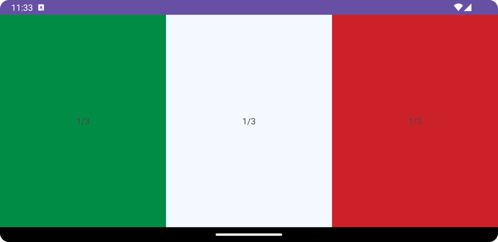
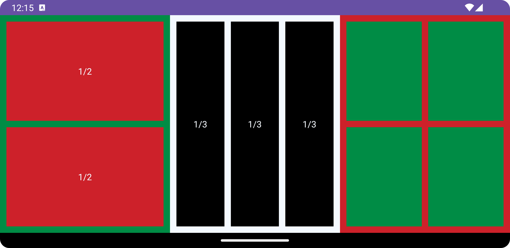
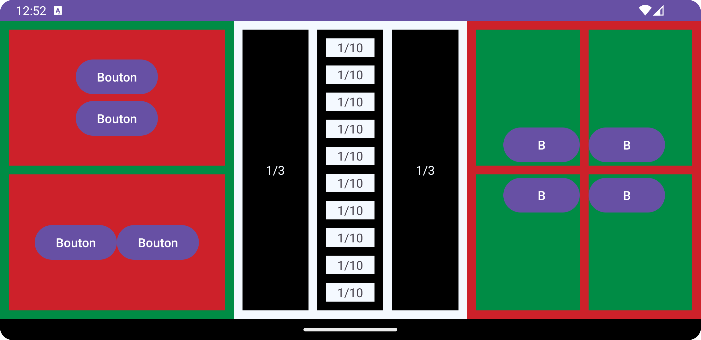

# Mise en page, LinearLayout

<Row>

<Column>

:::tip Avant la séance (2h)

Vous devez pensez à la mise en page des différents écrans de votre application

- Connexion avec nom d'utilisateur et mot de passe
- Inscription avec nom d'utilisateur et mot de passe
- Liste des tâches (accueil)
- Création d'une nouvelle tâche
- Consultation du détail d'une tâche

Pour les révisions, vous pouvez vous référer à la séance du cours 3N5:
[Mise en page](https://info.cegepmontpetit.ca/3N5-Prog3/recettes/b-mise-en-page)
:::

</Column>

<Column>

:::info Séance

On fera une démo pour donner des idées de mise en page.

Vous complétez les exercices de mise en page ainsi que les exercices de compréhension.

Vous devrez compléter les mises en page des différentes activités de votre projet.

:::

</Column>

</Row>

:::note Exercices de la semaine

## Exercice Dessin
Étant donné ce code XML, dessinez ce à quoi ressemblerait l'activité en mode portrait :
```xml showLineNumbers
<?xml version="1.0" encoding="utf-8"?>
<LinearLayout xmlns:android="http://schemas.android.com/apk/res/android"
    xmlns:tools="http://schemas.android.com/tools"
    android:id="@+id/main"
    android:layout_width="match_parent"
    android:layout_height="match_parent"
    android:orientation="vertical"
    tools:context=".TestActivity">
    
    <Button
        android:id="@+id/button"
        android:layout_width="match_parent"
        android:layout_height="wrap_content"
        android:text="Popopo !"/>
    
    <View
        android:layout_width="0dp"
        android:layout_height="0dp"
        android:layout_weight="1" />
    
    <LinearLayout
        android:layout_width="match_parent"
        android:layout_height="wrap_content"
        android:orientation="horizontal">
        
        <TextView
            android:layout_width="0dp"
            android:layout_height="200dp"
            android:layout_weight="1"
            android:background="#0000FF"
            android:text="" />
        
        <TextView
            android:layout_width="0dp"
            android:layout_height="wrap_content"
            android:layout_weight="2"
            android:text="Plop plop plop" />
        
    </LinearLayout>
    
</LinearLayout>
```

Une fois votre dessin terminé (et pas avant), créez un projet avec cette activité pour valider votre dessin.

## 👨‍🎓🤖 Exercice MiseEnPageA

Créez un projet appelé **MiseEnPageA** contenant une activité. Faites un layout avec un champ de saisie pour le courriel, un pour le mot de passe, un bouton d'inscription et un bouton de connexion.

La password doit être caché (avec des points), l'interface doit être claire : on sait quoi taper à quel endroit.

## 👨‍🎓👨‍🎓 Exercice MiseEnPageB

Téléchargez et roulez ce [projet](https://github.com/departement-info-cem/4N6-Mobile/tree/main/code/Proportions).
Nous voulons générer 2 TextViews côte-à-côte, où celui de gauche occupe 1/4 et celui de droite 3/4 de la largeur de l'écran.

En utilisant le débogeur graphique (dans View > Tool Windows > Layout Inspector), inspectez les largeurs de tous les TextViews.
Lesquels ont les proportions voulues?

Quelles sont les différences entre les 3 méthodes utilisées (les 3 couleurs)?
Assurez-vous de bien comprendre ce qui se passe, par exemple pourquoi les 2 TextViews ont les bonnes proportions sur certaines lignes et pas sur d'autres.

## 👨‍🎓🤖 Exercice MiseEnPageC

Créez un projet appelé **MiseEnPageC** contenant 1 seule activité.
Reproduisez la mise en page suivante en mode paysage : (n'utilisez pas de valeurs absolues, sauf pour du *padding* et des *margins*)



## 👨‍🎓🤖 Exercice MiseEnPageD

Copiez votre projet **MiseEnPageC** dans un dossier **MiseEnPageD**. Modifiez votre projet de l'exercice précédent pour reproduire la mise en page suivante :



## 👨‍🎓🤖 Exercice MiseEnPageE

Copiez votre projet **MiseEnPageD** dans un dossier **MiseEnPageE**. Modifiez votre projet de l'exercice précédent pour reproduire la mise en page suivante :



:::
