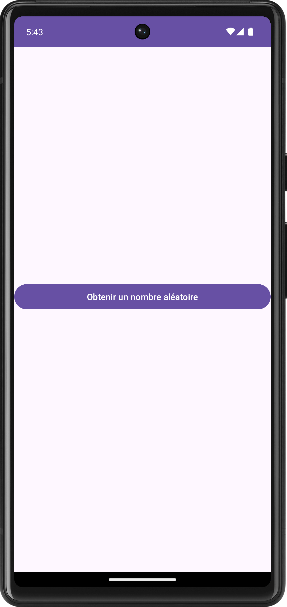

# Serveur Spring Boot : visite guidée et démarrage

<Row>

<Column>

:::tip Avant la séance

Explorez le [code du serveur de l'application](https://github.com/departement-info-cem/KickMyB-Server)

Vous pouvez également explorer la documentation de [Spring Boot](https://spring.io/projects/spring-boot).

Vous devez regarder les vidéos ci-dessous:

<Video url="https://www.youtube.com/watch?v=GvvL7n0pmp0" />

<Video url="https://www.youtube.com/watch?v=c96E9TvjSXU" />

:::

</Column>

<Column>

:::info Séance

Nous allons montrer comment partir le serveur. Comment mettre un point d'arrêt. À quel endroit est le code correspondant aux différentes URLs.

Nous allons voir également comment envoyer des requêtes au serveur avec le logiciel Postman.

:::

</Column>

</Row>

:::note Exercices de la semaine

### Exercice Chic Type

<Row>

<Column size="9">

Le projet [suivant](https://github.com/departement-info-cem/4N6-Mobile/tree/main/code/ChicType) a un problème. Votre mission sera de trouver le problème et de le corriger.

Lorsqu'on appuie sur le bouton "Obtenir un nombre aléatoire", l'application Android fournie effectue un appel réseau au web service qui se trouve à l'adresse suivante : [https://4n6.azurewebsites.net/exos/chic/type/](https://4n6.azurewebsites.net/exos/chic/type/). Le nombre aléatoire retourné par le web service devrait s'afficher dans un champ texte.

1. Dans postman, effectuez une requête vers le web service. Notez le type de donnée qui est dans le corps de la réponse.
2. Ouvrez l'application Android fournie dans Android Studio. Essayez d'appuyer sur le bouton.
3. Mettez des breakpoint et consultez le logcat pour tenter de comprendre pourquoi votre application n'arrive pas à traiter le nombre retourné par le web service.
4. Effectuez un correctif pour que l'application fonctionne correctement. Montrez votre correctif à votre enseignant.

</Column>

<Column size="3">

</Column>

</Row>

### Exercice Postman

Vous devez préparer un ensemble de requêtes avec postman pour créer un compte, accéder à la liste des tâches de l'utilisateur, créer une tâche et mettre à jour une tâche.

:::
