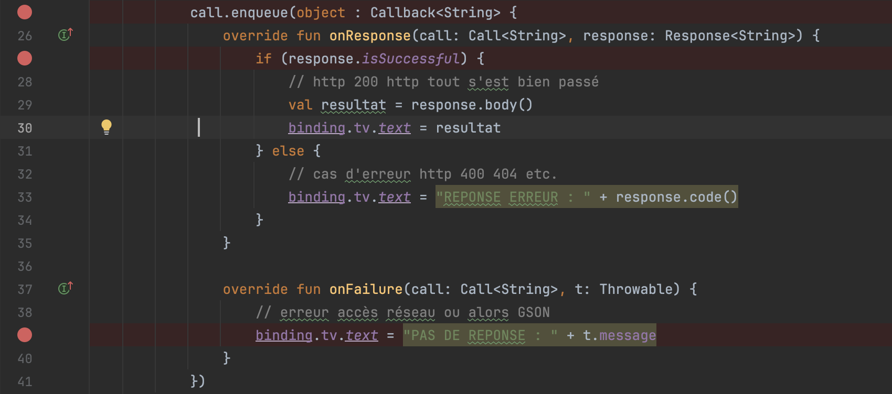

# HTTP 2 - Depuis un écran

:::tip
ATTENTION : L'outil principal de débogage pour les appels réseaux est le network inspector dans Android Studio.
1. Cliquer sur Fichier / File ou le symbole  ☰ en haut à gauche
2. Choisir View / Tool Windows / AppInspection
3. Dans la fenêtre AppInspection, choisir l'onglet **Network Inspector**
4. Tu devrais voir apparaître les appels réseaux de ton application
:::

Regarder la recette de base pour les étapes:
- [AndroidManifest.xml](retrofit-01-base?recette-string=AndroidManifest.xml)
- [build.gradle](retrofit-01-base?recette-string=build.gradle)
- [GitHubApi.kt](retrofit-01-base?recette-string=GitHubApi.kt)
- [RetrofitInstance.kt](retrofit-01-base?recette-string=RetrofitInstance.kt)

Le code de cette recette est disponible [ici](https://github.com/departement-info-cem/4N6-Mobile/tree/main/code/ComposeRetrofitBase).

Nous allons voir comment faire un appel à notre fonction depuis un écran:
- il va s'agir d'un appel asynchrone, autrement dit on n'attend pas la réponse pour continuer l'exécution
- on va rattacher un objet appelé Callback à notre appel pour traiter la réponse
- on aura 3 cas
  - un succès soit une réponse HTTP avec le code 200
  - une réponse du serveur mais avec un code d'erreur
  - un échec à recevoir une réponse

## MainActivity.kt

    L'écran suivant utilise Jetpack Compose pour l'interface graphique.

    <GHCode
            repo="4N6-Mobile"
            filePath="code/ComposeRetrofitBase/app/src/main/java/ca/cem/composeretrofitbase/MainActivity.kt"
            startLine="64"
            endLine="76"
          />

## debug

    Il est important de placer 3 points d'arrêt pour ton débogage:

    

    Il est aussi important d'utiliser le Network Inspector pour voir les appels réseaux:
    1. Cliquer sur Fichier / File ou le symbole  ☰ en haut à gauche
    2. Choisir View / Tool Windows / AppInspection
    3. Dans la fenêtre AppInspection, choisir l'onglet **Network Inspector**
    4. Tu devrais voir apparaître les appels réseaux de ton application
